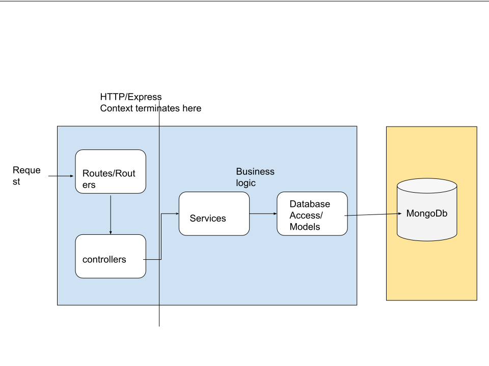

# message-api 

## Description

An application which manages messages and provides details about those messages,
specifically whether or not a message is a palindrome. This application support the
following operations:

- Create, retrieve, update, and delete a message
- List messages

## Docs

### [openapi spec](https://cexagupta-qlik-test.herokuapp.com/docs)

## Architecture



## Local setup

ensure defining following ENV

```bash
NODE_ENV=development

# database
DB_USER=<database user>
DB_PASS=<database password>
DB_HOST=mongodb+srv://<user>:<password>@<host>/<dbname>?retryWrites=true&w=majority
DB_NAME=<database name>
```

Commands supported:

```bash
# To start the app
npm run create-sample-users
npm run start:local

# To test the app
npm run create-test-users
npm run test:local

# Other available commands
npm run lint
```

for more details please check [package.json](package.json)

## CI setup 

I am using Github Actions as CI.

for more details please check following:

- [configuration](.github/workflows/node.js.yml)
- [coverage report](https://github.com/CExAGupta/message-api/actions?query=workflow%3A%22Node.js+CI%22+branch%3Amain+event%3Apush+actor%3ACExAGupta)

## Production setup [link](https://cexagupta-qlik-test.herokuapp.com/api/v1/messages)

For this repository CD is setup for main branch.

ensure defining following ENV

```bash
NODE_ENV=production

# database
DB_USER=<database user>
DB_PASS=<database password>
DB_HOST=mongodb+srv://<user>:<password>@<host>/<dbname>?retryWrites=true&w=majority
DB_NAME=<database name>
```

Commands supported:

```bash
# To start the app
npm run start
```
